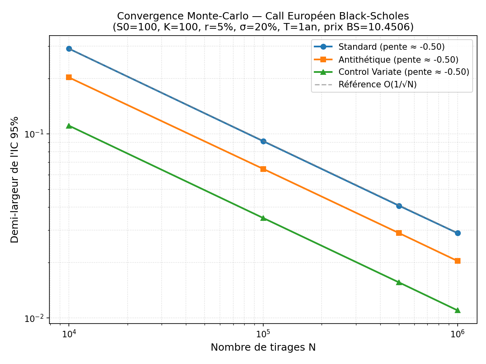

# Monte Carlo Option Pricer (Rust)

Pricer Monte-Carlo pour options européennes sous le modèle Black-Scholes (mouvement
brownien géométrique), implémenté en Rust, avec deux techniques de réduction de
variance : **variates antithétiques** et **control variate**.

## Modèle

Sous la mesure risque-neutre, le sous-jacent suit :

```
S_T = S_0 * exp[(r - σ²/2)T + σ√T · Z],    Z ~ N(0, 1)
```

Le prix d'un call européen est estimé par simulation Monte-Carlo de la moyenne
actualisée du payoff `e^{-rT} · max(S_T - K, 0)`, et vérifié contre la formule
fermée de Black-Scholes.

## Méthodes implémentées

| Méthode | Principe | Coût |
|---|---|---|
| **Standard** | Moyenne empirique des payoffs actualisés sur N tirages i.i.d. | N tirages de sous-jacent |
| **Antithétique** | Pour chaque Z tiré, on simule aussi -Z ; la moyenne des deux payoffs réduit la variance en exploitant la symétrie de la loi normale | 2N tirages, N paires |
| **Control Variate** | Correction du payoff par le sous-jacent actualisé `X = e^{-rT}S_T`, dont l'espérance exacte `E[X] = S_0` est connue sans simulation. Le coefficient optimal β = Cov(payoff, X) / Var(X) est estimé empiriquement | N tirages de sous-jacent |

Toutes les méthodes sont comparées **à budget de calcul égal** (même nombre de
tirages de sous-jacent), pour que les gains de variance soient directement
comparables.

## Résultats (S0=100, K=100, r=5%, σ=20%, T=1 an)

Prix Black-Scholes analytique : **10.4506**

| N | Standard | Antithétique | Control Variate (β) |
|---|---|---|---|
| 10 000 | 10.4055 ± 0.2899 | 10.3244 ± 0.2023 | 10.4742 ± 0.1107 (β=0.673) |
| 100 000 | 10.4470 ± 0.0912 | 10.4419 ± 0.0645 | 10.4296 ± 0.0349 (β=0.675) |
| 500 000 | 10.4567 ± 0.0407 | 10.4815 ± 0.0289 | 10.4590 ± 0.0156 (β=0.675) |
| 1 000 000 | 10.4545 ± 0.0289 | 10.4577 ± 0.0204 | 10.4479 ± 0.0110 (β=0.674) |

**Réduction de la largeur de l'IC 95% à N=1 000 000, à budget de calcul égal :**
- Antithétique : **-29.2%**
- Control Variate : **-61.8%**

Le control variate réduit la largeur de l'intervalle de confiance de ~62% par
rapport à la méthode standard, à budget de calcul identique, en utilisant le
sous-jacent actualisé comme variable de contrôle (`E[e^{-rT}S_T] = S_0`).

Le β estimé (~0.674) reste stable quel que soit N, ce qui confirme que
l'estimateur ne dérive pas et que la relation linéaire entre le payoff et le
control variate est bien capturée — cette valeur est du même ordre de grandeur
que le delta risque-neutre `N(d1)` du call, comme attendu théoriquement.



Les trois méthodes convergent au même taux théorique O(1/√N) (pentes ≈ -0.5 en
log-log), mais avec des constantes multiplicatives très différentes — c'est
cette constante, et non le taux de convergence, que les techniques de
réduction de variance améliorent.

## Tests et intégration continue

Le projet contient une suite de tests reproductibles. Les estimateurs acceptent un générateur pseudo-aléatoire injecté afin que les tests Monte-Carlo utilisent une graine fixe plutôt que `thread_rng()`. La suite vérifie notamment :

- la définition du payoff et la simulation GBM dans un cas déterministe ;
- le calcul de la moyenne et de l'intervalle de confiance ;
- le prix Black-Scholes sur une valeur de référence ;
- l'accord d'un estimateur Monte-Carlo seedé avec la référence analytique ;
- la réduction de l'incertitude obtenue par control variate et par variates antithétiques à budget comparable.

GitHub Actions exécute `cargo test --all-targets --locked` à chaque push et sur chaque pull request via `.github/workflows/ci.yml`.

Pour lancer la suite localement :

```bash
cargo test --all-targets --locked
```

## Structure du projet

```
mc-option-pricer/
├── .github/
│   └── workflows/
│       └── ci.yml
├── src/
│   └── main.rs
├── Cargo.toml
├── Cargo.lock
├── plot_convergence.py
├── results.csv
└── convergence_mc.png
```

## Utilisation

```bash
cd mc_pricer
cargo run --release
```

Pour régénérer le graphique de convergence après un nouveau run, mets à jour
les listes `ci_standard`, `ci_antithetic`, `ci_control_variate` dans
`plot_convergence.py` avec tes propres résultats, puis :

```bash
python plot_convergence.py
```

## Pistes d'extension

- **Quasi-Monte Carlo** (séquences de Sobol) pour une réduction de variance
  déterministe, en complément des techniques stochastiques ci-dessus.
- **Combinaison antithétique + control variate** sur les mêmes paires.
- **Extension à des payoffs path-dependent** (options asiatiques, barrières),
  avec un control variate analytique adapté (ex. approximation géométrique
  pour une option asiatique arithmétique).
- **Estimation du delta et des grecs** par différences finies ou par méthode
  pathwise, en réutilisant le même moteur de simulation.
